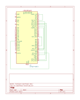

# STM32F446 Bare-metal Test

## Loopback Testing
This bare-metal test application covers loopback test, which is a fundamental technique to verify the functionality of a peripheral and its associated pins by sending data out and immediately receiving it back on the same microcontroller. It isolates the peripheral's functionality from external factors, allowing you to verify the internal setup before connecting to other devices or systems.

This section describes the necessary jumper wire connections on the STM32F446 Nucleo board to perform basic loopback testsin this application with several peripheral interfaces, based on the provided GPIO pin configuration.

Prerequisites
- STM32F446 Nucleo Development Board.
- A set of jumper wires (typically female-to-female are easiest for connecting between header pins).

### Loopback Test Wiring Configurations
The table below shows jumper wire connections required for each loopback test case :

| Test Case            | Connection 1 (From Pin) | Connection 2 (To Pin) | Notes                                        |
| :------------------- | :---------------------- | :-------------------- | :------------------------------------------- |
| DAC Output to ADC Input | PA4 (DAC1_OUT1) | PA0 (ADC1_IN0) | Verify Analog Conversion Chain |
| UART (USART1) | PA9 (TX) | PB7 (RX) | Verify Serial Communication |
| SPI (SPI1, SPI2) | PA5 (SPI1 SCK)  | PB10 (SPI2 SCK) | Propagate clock from master to slave |
|                  | PA15 (SPI1 NSS) | PB4 (SPI2 NSS)  | Select the only slave |
|                  | PA6 (SPI1 MISO) | PB14 (SPI2 MISO) | Verify Slave Data Transfer |
|                  | PA7 (SPI1 MOSI) | PB15 (SPI2 MOSI) | Verify Master Data Transfer |
| I2C | PB6 (I2C1 SCL) | PA8 (I2C3 SCL) | Propagate clock from either side |
|     | PB9 (I2C1 SDA) | PC9 (I2C3 SDA) | perform data transfer from either side |

Note :
- In SPI loopback test, SPI1 is configured as master, SPI2 as slave, with full-duplex mode enabled
- In I2C loopback test, either I2C1 or I2C3 can act as master which is programmable by software.

Wiring detail for loopback test is shown in the schematic diagram below :

